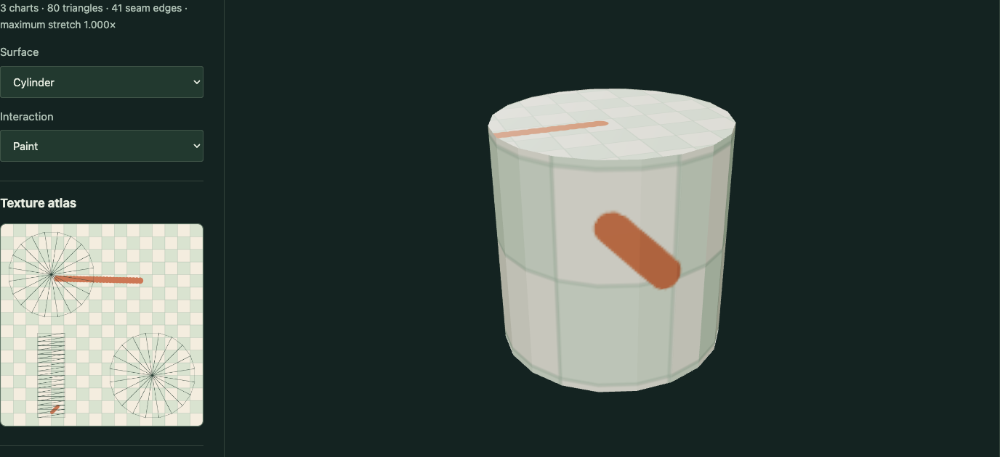
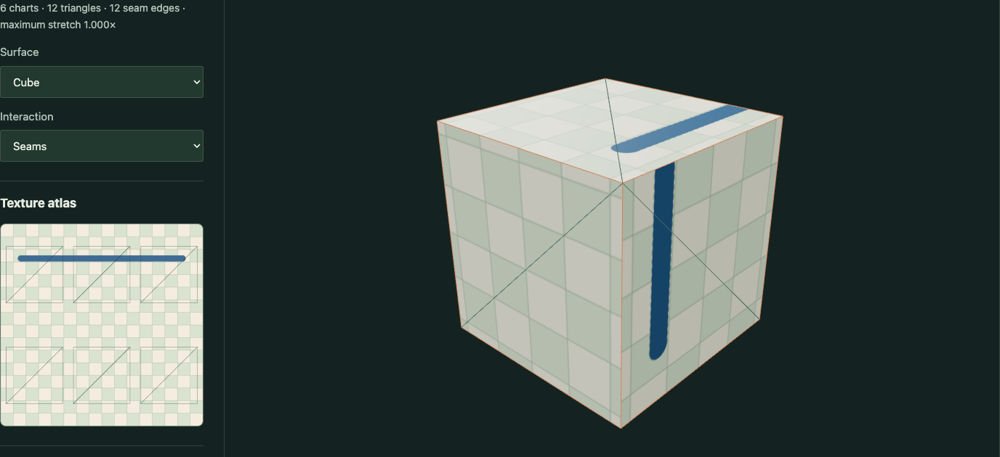

# UV Unwrap Studio

A runnable seam editor, least-squares conformal unwrap solver, and texture painting workbench. Changes are computed from the mesh; the atlas is not a pre-baked picture.

## Run

`npm install`, `npm run dev`, `npm test`, `npm run build`.

Select cube, cylinder, or folded ribbon. Pick an edge in the 3D view or cycle edges with the buttons, toggle seams, then unwrap. Paint on the 3D surface or the texture atlas. Export both the OBJ (per-corner UV coordinates) and the texture PNG.

## Implementation

Face-corner union/find duplicates vertices along marked seams while preserving shared vertices inside each chart. Two boundary vertices pin each chart. Cauchy–Riemann equations in each triangle's intrinsic coordinates form the weighted least-squares system; preconditioned conjugate gradient solves the normal equations. A deterministic padded grid packs charts. Jacobian singular-value ratios measure local angular stretch. A spherical brush around the raycast surface point is clipped and mapped into every intersecting triangle, so strokes cross chart seams. The same atlas is displayed beside the controls.

Based on [Lévy et al., Least Squares Conformal Maps, SIGGRAPH 2002](https://www.cs.jhu.edu/~misha/ReadingSeminar/Papers/Levy02.pdf).

## Scope and limitations

The 2,000-triangle bound keeps an interactive synchronous solve practical. Closed charts are explicitly rejected. Packing is deliberately simple; it is not texel-density optimized. Arbitrary cut patterns may produce overlapping/folded UVs: LSCM minimizes angular distortion but does not guarantee an injective solution. The stretch display does not test chart self-overlap. Surface-space brush footprints cross chart seams. A spherical brush can also affect a nearby back surface on very thin geometry. Undoing paint and arbitrary OBJ upload are outside this small tool; reset texture and the three editable geometric presets are provided. Canvas touches stay confined to the editor, leaving normal scrolling elsewhere.

## Run and explore

[Open the portfolio demo](https://zachsm.com/experiments/uv-unwrap-studio). This repository runs independently and exports the same implementation used by the portfolio.

Requires Node.js 22 or later.

```sh
npm ci
npm test
npm run dev
```

`npm run build` produces a static site in `dist`. Editing, uploaded files, and exports stay in the browser. No account, server processing, or GitHub Actions is required.

## Captured examples



Cylinder charts solved with LSCM and painted through their actual surface-to-UV mapping.



Six cube charts retain their own seams and share one paintable texture atlas.

Exact reproduction steps are recorded in [the example manifest](examples/manifest.json).

## Input lifecycle checks

Surface and atlas strokes stop on pointer cancellation, lost capture, browser blur, or switching tools. Already-painted pixels remain; returning to the cached tool restores its paint mode, camera controls, seam selection, and texture. Surface painting captures primary input before orbit controls handle it, so brushing does not also start a camera drag.

Run `npx playwright install chromium` once, then `npm run test:browser`. The browser regression checks actual atlas pixels before and after painting, cached tool switches during both kinds of stroke, capture release, no painting from hover after returning, pointer cancellation, and real touch input at 390px.
